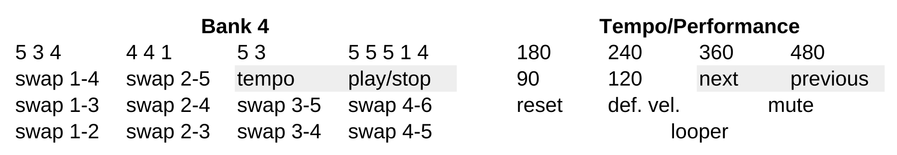

# algojuggle demo

May 2025, Albert Gräf <aggraef@gmail.com>

This directory has some demo patches which go along with the [LAC 25 paper](doc/algojuggle.pdf).

- algojuggle-demo.pd: The demo patch from the paper which uses the external in algojuggle.pd_lua.
- algojuggle-ex.pd: An extended version of the demo patch which includes automatic sequencing of various juggling patterns using qlist, as well as some real-time MIDI control (see below). You can also run multiple instances of this patch in concert. This is useful if you want to run an entire "ensemble" of algojuggle-ex patches taking input from different MIDI channels.
- algojuggle-1+10.pd: Ensemble patch with two algojuggle-ex subpatches which have been set up so that they listen on different MIDI channels (1 for melodic sequences, 10 for the drumkit).
- algojuggle-1+10+chords.pd: This is a version of the algojuggle-1+10 patch which also includes the chords.pd patch to play chord progressions, see below for details.

An explanation of algojuggle-demo.pd can be found in the paper. The algojuggle-ex.pd patch adds the following extra functionality:

- **Ready-made demo sequences** which go through various juggling patterns. This is in the qlist subpatch. Press the toggle above the qlist subpatch to start and stop the sequence. You can also engage the "loop" toggle to have the sequence loop until you stop it or turn the "loop" toggle off again. At present, two simple sequences are included in the seq1.txt and seq2.txt files. The first of these automatically gets loaded with the patch, and you can switch between them with the radio button in the main patch. You can edit those files (or the loaded sequence by clicking on the qlist object in the qlist subpatch) to modify the sequences as needed, or create your own.
- **Real-time MIDI control:** This lets you modify the MIDI notes to be played at any time, also during playback. It also provides some useful performance functions. The corresponding logic is in the lib/midiset Lua external located in the midi subpatch. This feature is explained in more detail in the following section.
- **Chords playback:** This extends the real-time MIDI control with a patch to play chord progressions in a fashion similar to the MPC's pad performance feature. This feature is implemented by a separate chords.pd patch in its own subdirectory, which also lets you record the chords to be assigned to each pad. Four sample chord banks are included in the chords/chords.txt file. At present, this requires a Launchpad X or Mini MK3 to work (suitable custom modes are included in the launchpad subdirectory). The chords.pd patch is included in the algojuggle-1+10+chords.pd patch, but you can also load it separately to use it with algojuggle-ex or your own patches. This feature is described in its own [README](chords/README.md) file.
- **MIDI clock sync:** This is in the lib/time subpatch. To make this work, you need to connect Pd's MIDI input to a device or application generating MIDI clocks. MIDI clock sync is enabled by turning on the toggle above the subpatch. Playback and tempo is then controlled by the clock source. The toggle below the subpatch indicates if the subpatch is currently receiving MIDI clocks. By changing the tempo with the bpm numbox (or the real-time MIDI controls described below) you can set the base pulse relative to a nominal base tempo of 120. That is, e.g., a bpm value of 240 will set the base pulse to eights so that the pulses run twice as fast, no matter what the actual tempo of the external clock is. The time subpatch will also set the playback position of the algojuggle object if the MIDI clock source provides song position pointer (SPP) messages. It also resets the playback position when the MIDI clock source stops (when receiving a realtime stop message, or after a timeout of 3 seconds if the MIDI clock stream stops without a stop message).

## Real-time MIDI control

Real-time MIDI control via the midiset external works with both a standard MIDI keyboard, or a drum controller which outputs on channel 10. At a basic level, this allows you to change the MIDI notes which get played back in the main patch. Just enter some MIDI notes with the keys or pads of your MIDI controller and midiset will modify the MIDI setup in the main patch accordingly. This function operates in *latch mode*, so new notes will be added in the order you play them, as long as you hold at least one key or pad. Releasing all keys/pads clears the current note list, so that you can enter a new one. The MIDI channel for output will be set to the most recent MIDI channel received on input.

It is also possible to filter incoming notes by MIDI channel. This makes it possible to run multiple instances of the algojuggle-ex patch in concert, each taking input on their own MIDI channel. To these ends, the midiset object takes an optional MIDI channel as its first creation argument. The midi subpatch has been set up so that it will take this argument from the first argument of the algojuggle-ex patch if it is used as a subpatch inside a parent "ensemble" patch. See algojuggle-1+10.pd for an example which has two algojuggle-ex subpatches listening on MIDI channels 1 and 10. If this argument isn't set, or if algojuggle-ex.pd is run as a main patch, midiset will listen on all MIDI channels (omni mode). You can also manually set the MIDI channel by replacing the $1 argument of the midiset object in the midi subpatch with the desired channel number.

### Performance Controls

For drum controllers, the midiset external can accommodate up to 3 consecutive banks (4x4 grids) of drum pads on MIDI channel 10 (starting at MIDI notes 36, 52, and 68, respectively). This covers most of the General MIDI drumkit. If your input device has it, a fourth bank (starting at MIDI note 84 on channel 10) can be used to engage some special performance functions which are laid out as shown in the table on the left:

- Row 4 (the topmost row) has four different siteswap patterns on the four pads. These are from the [Siteswap FAQ](http://www.juggling.org/help/siteswap/faq.html), where you can find a lot of these. The first pattern 5 3 4 is the default from the patch. Note that you can also get a whole lot more from these four by applying different site swaps to them.
- Rows 1-3 (counting from bottom to top) are used to trigger site swaps: 1-2, 2-3, 3-4, 4-5 in row 1, 1-3, 2-4, 3-5, 4-6 in row 2, 1-4, 2-5 in row 3. Note that the site swaps are laid out such that you find the adjacent (distance 1) swaps in the 1st row, distance 2 swaps in the 2nd row, and distance 3 swaps in the 3rd row.
- The last two pads in row 3 control playback. The 4th pad ("play/stop") toggles playback via the metro object in the main patch. The 3rd pad ("tempo") is used to go through different bpm values (30, 60, 90, 120, 180, 240, 360, 480 by default). You can also hold this pad while pressing any of the other pads in the two topmost rows to either go backwards (with the "start/stop" a.k.a. "previous" pad) or to select one of the six available bpm values >= 90 with the other pads (as shown in the upper half of the table on the right). Note that the slowest bpm values 30 and 60 can only be reached with the "previous" pad; these are primarily intended as a means to simulate a "tape stop" function, or for debugging purposes.
- You can also hold the "tempo" button while pressing a pad in the two bottom rows to invoke some additional performance functions (see the lower half of the table on the right). The upper row has some special functions: Pad 1 resets the playback position, which produces a kind of stutter effect when pressed repeatedly during playback. Pad 2 resets the playback velocities to their default values minvel = 80, maxvel = 120. Pads 3 and 4 (or any other pad or key on *any* connected MIDI device) mutes playback on the corresponding MIDI channel, taking into account the input MIDI channel if it has been set (see above). This is described in further detail below.
- The pads on the bottom row give you a kind of looper effect by repeating a given number of steps as long as you press the pad while also holding the "tempo" pad, resuming normal playback as soon as you release the pad. This feature has been designed to mimic the "roller/looper" strip on the Beatstep Pro sequencer. At present, pads 1-4 will repeat 4, 3, 2, and 1 steps, respectively, but this can be adjusted by editing the source code as needed. To utilize this function, press and hold the "tempo" button and then press and hold one of the pads as long as you want the effect to last.

The "mute" performance function needs further explanation. The pattern will keep running even if muted, it just won't generate any MIDI output. Pressing any pad or key again while holding the "tempo" button will resume MIDI playback at any time. This function will affect all instances of the algojuggle-ex patch running in omni mode. However, if you have MIDI channels assigned to your algojuggle-ex patches, as described above, then only those instances will be muted or unmuted whose channel matches the channel of the pad or key pressed while holding the "tempo" button. (Usually, this will be channel 1 on a keyboard, and channel 10 on a pad controller.) Thus, if you have two instances of the patch running, say, on MIDI channels 1 and 10, and you hold the "tempo" pad while pressing a key on channel 1, then only that instance will be muted or unmuted. Conversely, pressing any of the mute pads on the fourth bank of your pad controller, or any pad on any of the other banks, will mute/unmute channel 10 (the drum channel). In a 2-channel setup, this allows you to quickly mute either the melody or the drums if needed.

These functions can be triggered at any time, also (and especially) during playback. They can be customized by editing the code in midiset.pd_lua. In particular, the lists of patterns, site swaps, bpm values, and looper step numbers available on bank 4 can be changed by editing the corresponding tables in the Lua source.

### Controller Support

The controls described above should work with any keyboard or drum controller, such as the AKAI MPK Mini, Novation Launchkey, or the Novation Launchpad. (You may have to configure the Drum pad mode of the latter so that it outputs to MIDI channel 10. Also note that some of the devices may only offer a limited number of drum pads which will limit the available range of notes and extra functionality.) Special support for a number of other devices is available, see below.

#### Donner Starrypad

The midi subpatch has some special support for the [Donner Starrypad](https://us.donnermusic.com/products/donner-dpd-16-pad-controller-black), a budget drum controller with nice pads and some extra controls which can be put to good use.  The Starrypad lacks a 4th bank, but we emulate the extra functionality with some of the buttons on the device:

- play button (CC60): This toggles playback (via the metro object in the main patch) on and off (like the play/stop pad on bank 4).

- rec button (CC62): This toggles MIDI clock sync (via the corresponding toggle in the main patch). As soon as this option is enabled and the patch begins receiving MIDI clocks from an external device, it starts playback.

- button A (CC26): Holding this button temporarily switches the pads to a "virtual" bank 4, giving access to the extra performance functions. This works no matter which of the three built-in banks of pads is active, and the Starrypad returns to that bank as soon as button A is released. (Note that this will only work as advertised if you do not use the arrow up/down buttons for transposing the pads. Use the PAD BANK button to cycle through the built-in banks instead.)

- button B (CC27): This works like the tempo pad on bank 4, thus pushing this button goes through the different bpm values. Holding this button also temporarily switches the pads to bank 4 so that you can select different bpm values or execute any of the other special performance functions with the pads as explained above.

- As a bonus, fader 1 (CC20) and 2 (CC21) on the Starrypad can be used to change the minvel and maxvel values of the MIDI setup in the main patch, and knob 1 (CC28) can be used to change the tempo (bpm value).

#### Arturia Beatstep Pro

Arturia's [Beatstep Pro](https://www.arturia.com/products/hybrid-synths/beatstep-pro/overview) is a popular dedicated step sequencer and pad controller. We have implemented special support so that it can be used with the algojuggle patch in a fashion similar to the Starrypad. As a bonus, the Beatstep Pro can also send MIDI clocks to drive playback if you set SYNC to INT (internal) and use the device's own tempo and transport controls, see below.

The special functions are only available in control mode which needs to be set to MIDI channel 10 to make everything work as advertised. (You also need to disable scene mode on the device so that the step buttons generate normal MIDI CC data.) In that mode, encoders 2 and 3 can be used to set min and max velocity values (like fader 1 and 2 on the Starrypad). Encoder 4 sets the tempo (like knob 1 on the Starrypad) for normal MIDI playback, if not using MIDI clock sync.

Step buttons 1 and 2 work like the Starrypad's A and B buttons, so holding button 1 lets you change patterns and apply siteswaps with the pads, while holding button 2 lets you switch between tempo presets (or invoke one of the other performance functions in the two bottom rows we discussed earlier). Step buttons 3 and 4 work as toggles enabling playback and MIDI sync, like the play and rec buttons on the Starrypad. Moreover, the roller/looper touch strip on the device can be used to invoke the looper functionality. This works the same no matter whether transport is actually rolling on the device itself and also works outside of control mode. (To make this work, make sure that the Touch Strip MIDI Send/Receive option is enabled in the device settings, so that the strip actually generates MIDI CC data.)

Note that you can initiate playback via the Beatstep's own transport controls by switching on MIDI clock sync in the patch (via step button 4) and then using the play/pause and stop buttons on the device. This also allows you to change tempo using the rate encoder and the tap tempo button on the device, which makes controlling playback much more convenient.

Also note that while all the special functions accessible via the encoders and step buttons are only available in control mode, you can still switch to the sequencer lanes in order to enter notes as usual and use the playback controls at the same time (when using MIDI clock sync).

#### Novation Launchkey Mini

The midi subpatch also provides some similar (albeit more limited) controls for the [Launchkey Mini MK3](https://novationmusic.com/products/launchkey-mini-mk3). Specifically, the play and rec buttons toggle playback and MIDI clock, and the knobs 2, 3, and 4 have been set up to control minvel, maxvel, and tempo, like CC20, CC21, and CC28 on the Starrypad.

**NOTE:** I have my Launchkey Mini set up so that the knobs 1-8 emit CC1-8, so CC2-4 are the CC numbers you'll find as alternative bindings in the subpatch. This isn't the factory default (CC21-28), but I prefer to have it that way and this also has the advantage that these bindings won't interfere with the assignments on the Starrypad. If your Launchpad uses the default CC numbers for the knobs or you use some other custom configuration, you will thus have to adjust the CC numbers in the subpatch accordingly.

#### Novation Launchpad

As already mentioned, the performance controls describe above should work pretty much out of the box on most Novation Launchpad controllers, if you configure the Launchpad's drum pad mode with the Novation Components software so that it emits notes on MIDI channel 10. However, for your convenience we have also included some suitable custom modes specifically for the [Launchpad X](https://novationmusic.com/products/launchpad-x) and the [Launchpad Mini MK3](https://novationmusic.com/products/launchpad-mini-mk3), you can find these in the launchpad subdirectory, please check the corresponding [README](launchpad/README.md) for details.

**NOTE:** It appears that for some reason, in the custom modes the Launchpad X emits the same note data on *both* its MIDI and DAW ports. Having both ports connected will confuse the algojuggle-ex patch and result in spurious double notes. Therefore it is important that you only connect one of these ports (typically the MIDI port) to Pd's MIDI input when running algojuggle-ex. (None of the other MK3 Launchpad models have this defect, so it is safe to also have the DAW port connected with both the Mini and Pro models.)