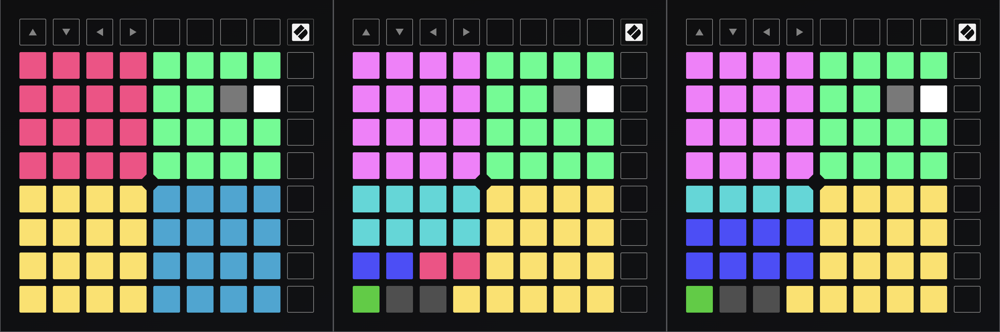

# Custom Launchpad modes for the algojuggle and chord patches

There are three different custom modes, one collection (custom modes 1, 3, and 3b) for the Launchpad Mini Mk3, and functionally equivalent collections (custom modes 5, 6, and 7) for the Launchpad X and the Launchpad Pro Mk3. You can find these as algojuggle*.syx files in the corresponding subdirectories.

As a bonus, I've also included isomorphic-keys2.syx for the Launchpad Mini Mk3. This is an alternative for mode 2 on the Mini which provides an isomorphic keyboard similar to what is readily available on the Launchpad X and Pro.

**Note:**  These are sysex (system exclusive) files which can be transferred to your device with any sysex librarian or other program with sysex transfer capability, such as Christoph Eckert's [Simple Sysexxer](https://sourceforge.net/projects/sysexxer/) on Linux, snoize's [SysEx Librarian](https://www.snoize.com/SysExLibrarian/) on the Mac, or [MIDI-OX](http://www.midiox.com/) on Windows. See, e.g., the [Sweetwater Knowledge Base](https://www.sweetwater.com/sweetcare/articles/how-do-i-send-and-receive-sysex-on-pc-or-mac/) for details. Make sure that you pick the right files for the type of device that you have, otherwise they will fail to load. You may also want to back up your existing custom modes on the device with the [Novation Components](https://novationmusic.com/components) software first.

Here's how the custom modes look on the LP X, mode 5 on the left, mode 6 in the center, and mode 7 on the right (corresponding modes for the LP Pro and Mini Mk3 will look pretty much the same):

## Drumpad Mode (LP Mini mode 1, LP X/Pro mode 5)

Mode 1/5 (left image) is a modified drum pad layout, with pad banks 1 and 2 (starting at notes 36 and 52, from bottom to top, colored yellow and rose) on the left, and pad banks 3 and 4  (starting at notes 68 and 84, colored blue and green) on the right. These are all laid out as the usual MPC-style 4x4 grids, with the lowest note in the lower left corner. All pad banks emit notes on MIDI channel 10 (the General MIDI drumkit channel), with pad banks 1-3 covering most of the GM drumkit. Bank 4 (the green one) has a special meaning in the algojuggle-ex patch, controlling various performance functions (as described in the toplevel [README](../README.md)). Also, this bank has the special tempo and start pads, in the second-highest row on the right, marked gray and white.

## Drumpad/Chords Mode (LP Mini mode 3, LP X/Pro mode 6)

Mode 3/6 (center image) is a heavily customized layout with drum pads on the right, and a collection of chord-related pads on the left. The yellow and green 4x4 grids on the right are the same as bank 1 and 4 on the drumpad mode and their function is identical. However, the yellow bank is extended one note down with the yellow pad to the left of the grid, to give you an additional note 35 (acoustic bass drum in the GM drumkit). In addition, there's a green pad in the bottom left corner which lets you toggle MIDI sync in the algojuggle-ex patch. This pad turns red when pushed, to indicate that MIDI sync is on.

The remaining pads in the topmost 7 rows on the left side are used to operate the chords patch. These all emit notes on channel 9 which is the MIDI channel the chords patch listens on when it is in its default playback mode, please check the [chords README](../chords/README.md) for details. The pink 4x4 grid at the top is used to play chords from the current chord bank. The 8 cyan pads below the chord pads are used to select 8 different banks of chords. Below that are two deep blue pads to transpose the chords by octaves (down/up) and two rose pads to transpose by semitones (down/up). The current amount of octave and semitone transposition is shown in the corresponding numboxes in the chords patch.

There are two additional unlit pads in the bottom row which are intended to be used with the lac-demo.pd patch in the lac-demo branch of the algojuggle-demo repository. In contrast to the other pads, these emit different CC messages (CC123 on the left unlit pad, CC64 on the right pad) when pushed. The CC123 (all-notes off) message simply gets passed through on MIDI channel 1. This is provided as a "MIDI panic" button which should silence any sounding notes on connected MIDI synthesizers. The CC64 (sustain pedal) message is processed by the Switch A/B subpatch in the lac-demo.pd patch and is part of the Raptor integration (see the Raptor Bridge section below).

## Drumpad/Chords/PC Mode (LP Mini mode 3b, LP X/Pro mode 7)

Mode 3b/7 (right image) provides an alternative to the drumpad/chords mode which sacrifices some of the chord controls (banks 5-8 and the transpose buttons) and replaces them with 8 buttons (the deep blue pads) to trigger PC1-8 messages to change presets in Raptor, see the Raptor Bridge section below.

Note that since the Launchpad Mini doesn't actually have a fourth custom mode available, this mode will replace mode 3 instead, so on the Mini you'll have to decide which of the two alternative drumpad/chord modes you want to use. On the Launchpad X and Pro, this installs as a separate mode 7.

## Raptor Bridge

The lac-demo branch provides some experimental integration with the [Raptor 7](https://github.com/agraef/raptor7/tree/lac-demo) arpeggiator. To make this work, you need to use the lac-demo patches in the lac-demo branches of both the algojuggle-demo and raptor7 repositories. Also, both demo patches need to be loaded in the same Pd instance, since they rely on some global receivers in both patches to provide the necessary tie-ins between algojuggle and Raptor. In addition, to be able to use Raptor's built-in support for the Launchpad, you need to make sure that the Launchpad's DAW ports are connected to Pd's MIDI ports 3 or 4, on *both* input and output. If this is all set up as described, the algojuggle lac-demo.pd patch provides the following integration features:

- The patch implements start/stop sync without requiring MIDI clock sync on either side. For this you need to enable the big Raptor Sync toggle in the lac-demo.pd patch (which it is by default). Then simply start algojuggle with the white pad as usual and it will start playback in Raptor along with it. Note that you still need to make sure that the tempo in the two patches match up.
- The Switch A/B subpatch enables you to quickly switch the melody part on MIDI channel 1 between both arpeggiators, by pushing the CC64 pad in any of the two alternative drumpad/chord modes (mode 3/6 or 3b/7). The same function can also be accessed with a sustain pedal connected to a MIDI keyboard, or by pushing the left bang control above the subpatch. The subpatch also handles CC123 (all-notes-off) messages by forwarding these to any connected synthesizers. This MIDI panic function can be accessed either with the CC123 pad in modes 3/6 and 3b/7, or by pushing the right bang control above the subpatch.
- Using the PC1-8 buttons in the drumpad/chord/pc mode (mode 3b/7) you can quickly switch between eight different Raptor presets. (These can be configured with the arguments of the pc subpatch in the Raptor patch).
